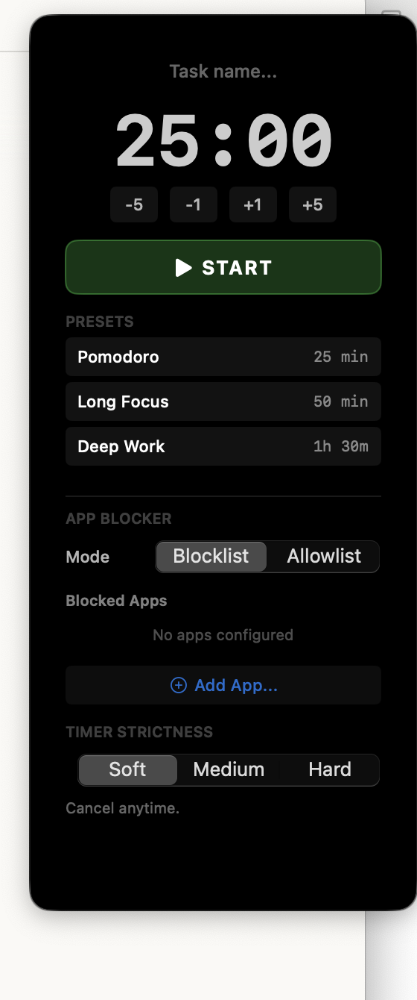
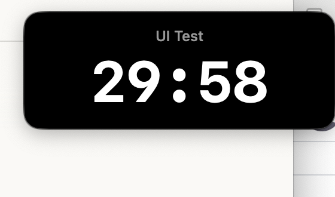
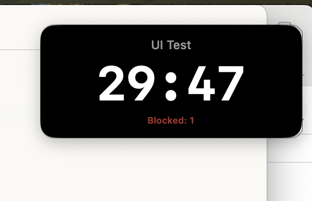

# DeepFocus

A macOS menu bar app that keeps you on task. Start a countdown timer, block distracting apps, and make quitting harder than staying focused.

## Screenshots

| Idle — configure your session | Timer running | App blocked |
|---|---|---|
|  |  |  |

## Features

### Timer
- Floating HUD panel — always on top, draggable, remembers position
- Presets: Pomodoro (25 min), Long Focus (50 min), Deep Work (90 min)
- Adjustable duration with ±1 / ±5 min buttons
- Task name editable before and during a session
- Menu bar shows remaining time while running
- System notification when the session completes

### App Blocker
Configure apps to block (or apps to allow) before starting. When you switch to a blocked app during a session, it's immediately hidden and focus returns to wherever you were.

- **Blocklist mode** — block specific distracting apps
- **Allowlist mode** — only permit specific apps; everything else is blocked
- Handles the case where a blocked app is already focused when the timer starts
- Block counter shown on HUD so you can see how many times you slipped

### Block Feedback
Every block event triggers three simultaneous effects so it's clear the blocker acted, not a random glitch:
- HUD shakes
- Border flashes orange
- Toast label fades in: "⛔ AppName blocked"

### Timer Strictness

| Mode | Behavior |
|------|----------|
| **Soft** | Cancel anytime — no friction |
| **Medium** | Must solve 3 math problems in a row to cancel. Wrong answer resets progress. |
| **Hard** | Cancel button hidden. Normal quit blocked. Must Force Quit (⌘⌥⎋) to exit. |

## Requirements

- macOS 14 (Sonoma) or later
- No entitlements or special permissions required

## Installation

Download the latest `.dmg` from [Releases](../../releases), open it, and drag DeepFocus to your Applications folder.

## Building from Source

```bash
git clone https://github.com/tiny-dev-industries/deepfocus
cd deepfocus
open DeepFocus.xcodeproj
```

Or build a release DMG:

```bash
./create_dmg.sh
```

The DMG is written to the project root and automatically copied to `~/Public/Drop Box` if it exists.

## Running Tests

```bash
xcodebuild test \
  -project DeepFocus.xcodeproj \
  -scheme DeepFocus \
  -destination 'platform=macOS'
```

---

Built by [Tiny Dev Industries](https://github.com/tiny-dev-industries)
